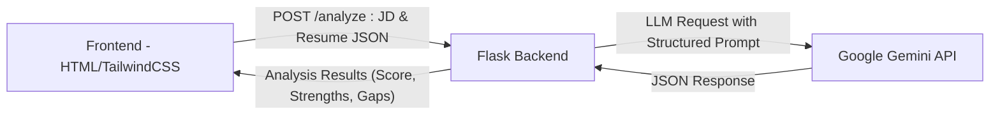

# 🧠 Smart Resume Screener  
### _AI-Powered JD–Resume Analyzer using Google Gemini_

<p align="center">
  
  
  
  
</p>

> 🚀 A full-stack AI application that analyzes resumes against job descriptions using **Google Gemini API**.  
It generates an intelligent **match score**, identifies **key strengths**, and flags **critical skill gaps** — all via structured JSON output.

---


## 🧩 Features

✅ **AI-Driven Resume Analysis** — Scores resumes against JDs using Gemini.  
✅ **Structured Output** — Returns consistent, valid JSON following a strict schema.  
✅ **Full-Stack Setup** — HTML + Tailwind frontend with Flask backend.  
✅ **Cross-Origin Ready** — CORS support for local or hosted environments.  
✅ **Error Resilience** — Handles API errors, JSON decoding, and server issues gracefully.  

---

## 🏗️ System Architecture

The Smart Resume Screener follows a **3-tier AI architecture** integrating frontend, backend, and an LLM service.  



### 🧠 Workflow Summary
1. The **user** enters a Job Description and Resume text in the frontend.  
2. The **frontend (HTML/JS)** sends both texts to the Flask backend using a JSON POST request.  
3. The **backend** sends a structured prompt with schema to the **Google Gemini API**.  
4. Gemini returns a **strict JSON object** containing match score, strengths, and gaps.  
5. The backend validates and returns it to the frontend for visual rendering.  

---

## 🧠 LLM Prompt Design (Used in This Project)

### 🔸 System Instruction (Exact from Backend)
```text
You are a highly efficient and accurate Senior Technical Recruiter AI.
Your task is to analyze a candidate's resume against a Job Description (JD).
You must follow these steps precisely:
1. Score the candidate's match level on a scale of 1 to 10 (1 being a poor match, 10 being a perfect match).
2. Identify the top 3-5 technical and experience-related Strengths that align directly with the JD.
3. Identify 1-3 critical Gaps (missing required skills, insufficient experience, etc.) relative to the JD. If no gaps are found, return "None identified."

Your entire response MUST be a single, valid JSON object that strictly adheres to the provided JSON schema.
Ensure the 'candidate_name' is extracted from the resume if possible, otherwise use a generic label like 'Candidate 1'.
```

### 🔸 Response JSON Schema (Used by Gemini API)
```json
{
  "type": "object",
  "properties": {
    "match_score": "integer (1–10 scale of candidate-job match)",
    "candidate_name": "string (extracted from resume or generic name)",
    "key_strengths": "string (paragraph listing 3–5 strengths relevant to JD)",
    "identified_gaps": "string (paragraph listing 1–3 missing or weak areas, or 'None identified.')"
  },
  "required": ["match_score", "candidate_name", "key_strengths", "identified_gaps"]
}
```

---

## 🏗️ Project Structure

```
Smart-Resume-Screener/
├── resume_screener_backend.py     # Flask backend (AI logic + Gemini integration)
├── resume_screener_frontend.html  # Tailwind + JS frontend
└── README.md                      # Documentation (this file)
```

---

## ⚙️ Tech Stack

| Layer | Technology |
|-------|-------------|
| **Frontend** | HTML5, Tailwind CSS, JavaScript (Fetch API) |
| **Backend** | Python 3.x, Flask, Flask-CORS |
| **AI Model** | Google Gemini (`google-genai` SDK) |
| **Response Format** | Structured JSON Schema |

---

## 🚀 Getting Started

### 1️⃣ Clone the Repository
```bash
git clone https://github.com/yourusername/smart-resume-screener.git
cd smart-resume-screener
```

### 2️⃣ Install Backend Dependencies
```bash
pip install flask flask-cors google-genai
```

### 3️⃣ Set Up Environment Variables
Get your API key from [Google AI Studio](https://aistudio.google.com/).

```bash
# macOS / Linux
export GEMINI_API_KEY="your_api_key_here"

# Windows
set GEMINI_API_KEY="your_api_key_here"
```

---

## 🧠 Running the Application

### Step 1: Run the Flask Backend
```bash
python resume_screener_backend.py
```
Server will start at:
```
http://127.0.0.1:8080
```

### Step 2: Open the Frontend
Open `resume_screener_frontend.html` in your browser.

> 💡 To deploy online, change the `API_URL` in the HTML to your backend domain.

---

## 📡 API Documentation

### Endpoint: `/analyze`
**Method:** `POST`  
**Content-Type:** `application/json`

#### 📥 Request Example
```json
{
  "job_description": "Full-stack developer skilled in React and Python.",
  "candidates": [
    {
      "id": "Candidate 1",
      "resume_text": "Experienced in ReactJS, Flask, and REST APIs."
    }
  ]
}
```

#### 📤 Response Example
```json
{
  "status": "success",
  "results": [
    {
      "candidate_id": "Candidate 1",
      "analysis": {
        "match_score": 9,
        "candidate_name": "John Doe",
        "key_strengths": "Strong in React, Flask, and REST API development.",
        "identified_gaps": "Limited AWS deployment experience."
      }
    }
  ]
}
```

---

## 🎨 UI Highlights

- Clean, dark theme built with Tailwind CSS  
- Responsive design for desktop and mobile  
- Score indicator with color-coded results:
  - 🟢 **Shortlisted** (≥ 8)
  - 🟡 **Review** (3–7)
  - 🔴 **Low Match** (< 3)

---

## 🧩 Backend Highlights

- Flask API with Gemini integration  
- CORS support for frontend compatibility  
- Detailed error handling for API and JSON decode errors  
- Structured AI response enforcement via schema  

---

## 🧾 Environment Variables

| Variable | Description |
|-----------|-------------|
| `GEMINI_API_KEY` | Google Gemini API key (required) |
| `PORT` | Default: `8080` |

---

## 🌍 Deployment Guide

- **Local:** Open `resume_screener_frontend.html` in a browser while Flask runs locally.  
- **Remote:** Deploy Flask backend on Render, GCP, or AWS; host frontend on Netlify or GitHub Pages.  
- Update this line in frontend JS:
  ```js
  const API_URL = 'https://your-deployed-backend.com/analyze';
  ```

---

## 🧪 Future Enhancements

- [ ] Multi-candidate batch screening  
- [ ] Resume file upload (PDF/DOCX)  
- [ ] Dashboard for analytics and trends  
- [ ] Docker + Render deployment template  

---

## 🤝 Contributing

Contributions are welcome! 🎉  
Follow these steps:

```bash
git checkout -b feature/new-feature
git commit -m "Add new feature"
git push origin feature/new-feature
```

Then open a Pull Request 🚀

---

## 📜 License

This project is licensed under the **MIT License**.  
See the [LICENSE](LICENSE) file for details.

---

<p align="center">
  <sub>Built with ❤️ using Flask, Tailwind, and Google Gemini</sub>
</p>
